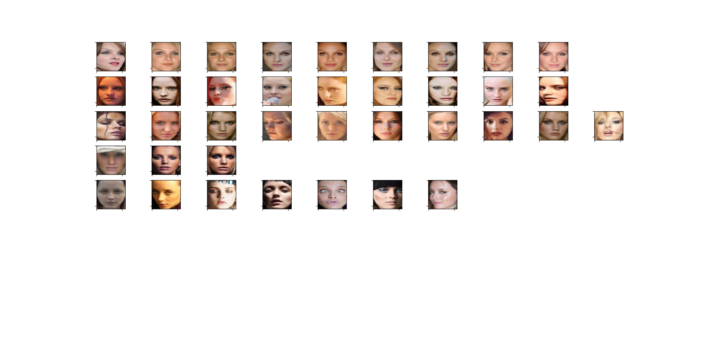
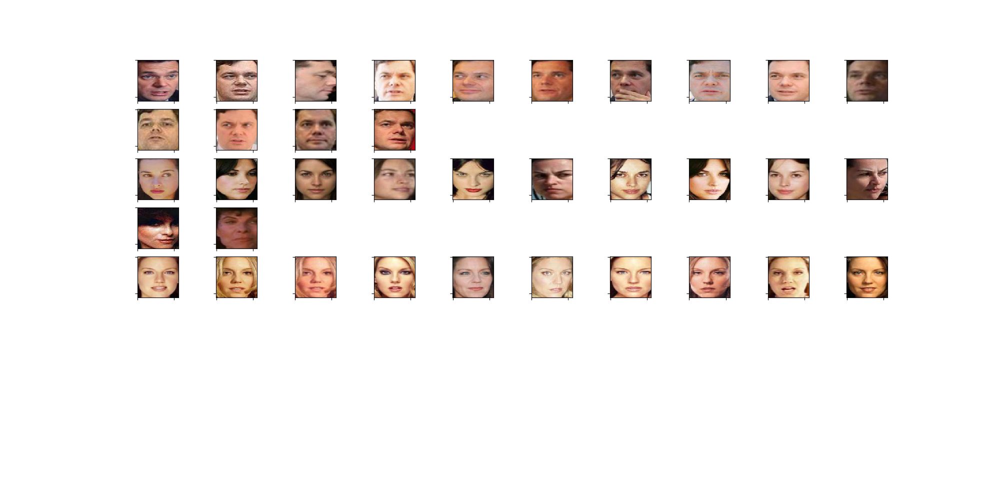
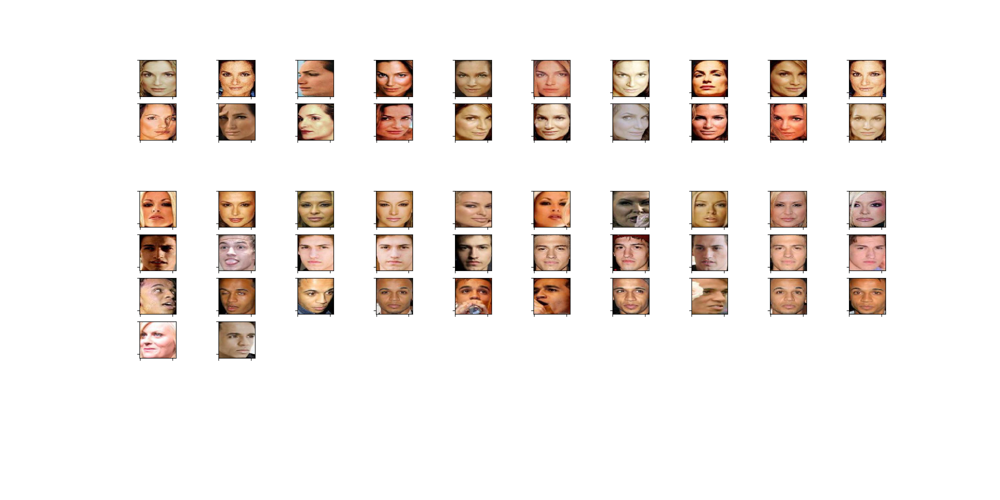
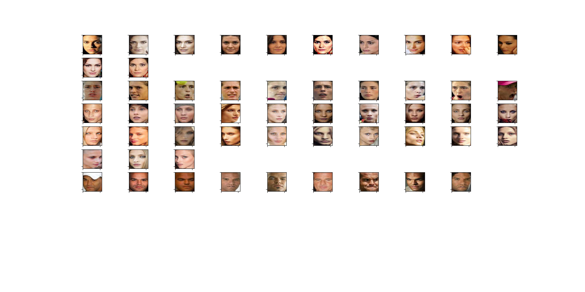
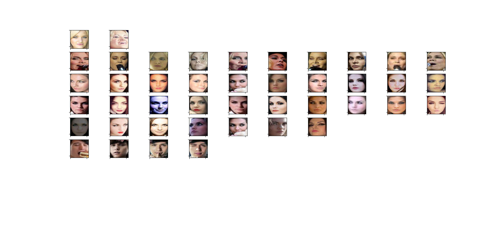
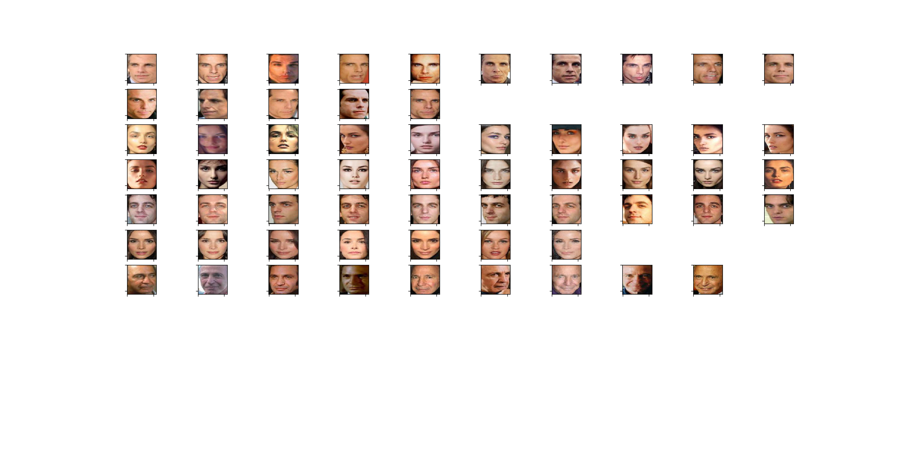

Attribute specific models
#########################

Approach
~~~~~~~~

Experiment Jun 2020:
~~~~~~~~~~~~~~~~~~~~

- The objective here is to split Gallery and Probe such that for a given class and 5 attributes(*Bangs,Mustache,Goatee,Smile,Eyeglasses*):

  - Gallery and probe contain images **without any specific attributes** any specific attribute.
  - Gallery and probe contain images **with specific attributes**
  - Gallery **without any specific attribute** and probe **with specific attributes** 

| P1 -> Probe=Gallery=No Attribute
| P2 -> Probe=Gallery=Attribute Present
| P3 -> Probe=Attribute, Gallery=No Attribute

===============  ===============  ===================  ==================  ================  ===========  
  Attribute          State           Genuine/Imposter   ImgCount/Classes   Verification Acc   Threshold
===============  ===============  ===================  ==================  ================  ===========
   Normal             P1              100/100                6197/563            0.915           1.196
   Eyeglasses         P2              100/100                620/189             0.94            1.146
   ..........         P3              100/100                620/189             0.93            1.43 
   Goatee             P2              100/100                720/90              0.93            1.1098
   ..........         P3              100/100                720/90              0.93            1.43
   Mustache           P2              100/100                523/70              0.90            1.1099
   ..........         P3              100/100                523/70              0.93            1.43
   Sideburns          P2              100/100                676/80              0.93            1.1018
   ..........         P3              100/100                676/80              0.879           1.32
   Bangs              P2              100/100                2520/364            0.92            1.3
   ..........         P3              100/100                2520/364            0.90            1.31
   Smiling            P2              100/100                6993/567            0.93            1.118
   ..........         P3              100/100                6993/567            0.879           1.188
===============  ===============  ===================  ==================  ================  ===========

- Sample image per class of each of the above:

Eyeglasses

  .. image:: ./myImages/proj/EyeGlasses.jpg
     :scale: 50 %
     :align: center

Goatee

  .. image:: ./myImages/proj/Goatee.jpg
     :scale: 50 %
     :align: center

Mustache

  .. image:: ./myImages/proj/Mustache.jpg
     :scale: 50 %
     :align: center

Sideburns (Face detector obscuring the feature)

  .. image:: ./myImages/proj/Sideburns.jpg
     :scale: 50 %
     :align: center

Smiling

  .. image:: ./myImages/proj/Smiling.jpg
     :scale: 50 %
     :align: center

Experiment 19 Jun 2020
~~~~~~~~~~~~~~~~~~~~~~

**Objective:** Remove "normal" images which don't have any "prominent" feature counter parts. And then increase genuine impostor pair to 200/200 instead of 100/100 and report the same results as above:

1)Removal of normal: Found only the following two classes have "normal" images with no counterpart on any other "prominent" features:

          |                           105
          |                           263

2)For 400/200 and 200/200 Genuine/Impostor pair 

| P1 -> Probe=Gallery=No Attribute
| P2 -> Probe=Gallery=Attribute Present
| P3 -> Probe=Attribute, Gallery=No Attribute

.. _PairsTable:

.. csv-table:: Results upto 1500 pairs.
   :file: ./mycsvsheets/SimilarityDiff.csv
   :header-rows: 1

Experiment 24 Jun 2020
~~~~~~~~~~~~~~~~~~~~~~

**Objectives:**
- increase Sample size to 1500 (updated in the PairsTable_ above)
- Analyze the **normal** class to get a sense of the variations. Images below: NOTE point below: 
  
  - Please right-click and View Image to expand for a closer look
  - Each row is mostly a single class. Sometimes overflowing to the next row.
  - There is no signifcance of each image (separated by huge space); they are just 6 individual screenshots

